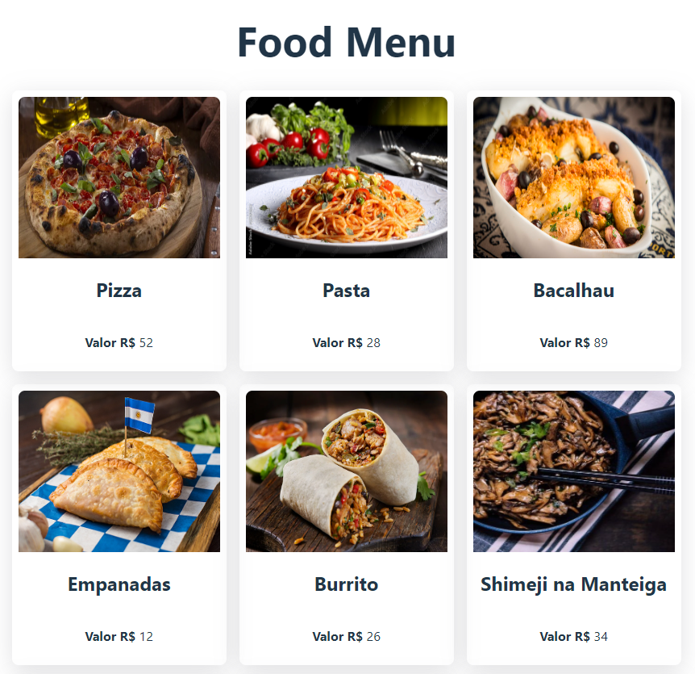
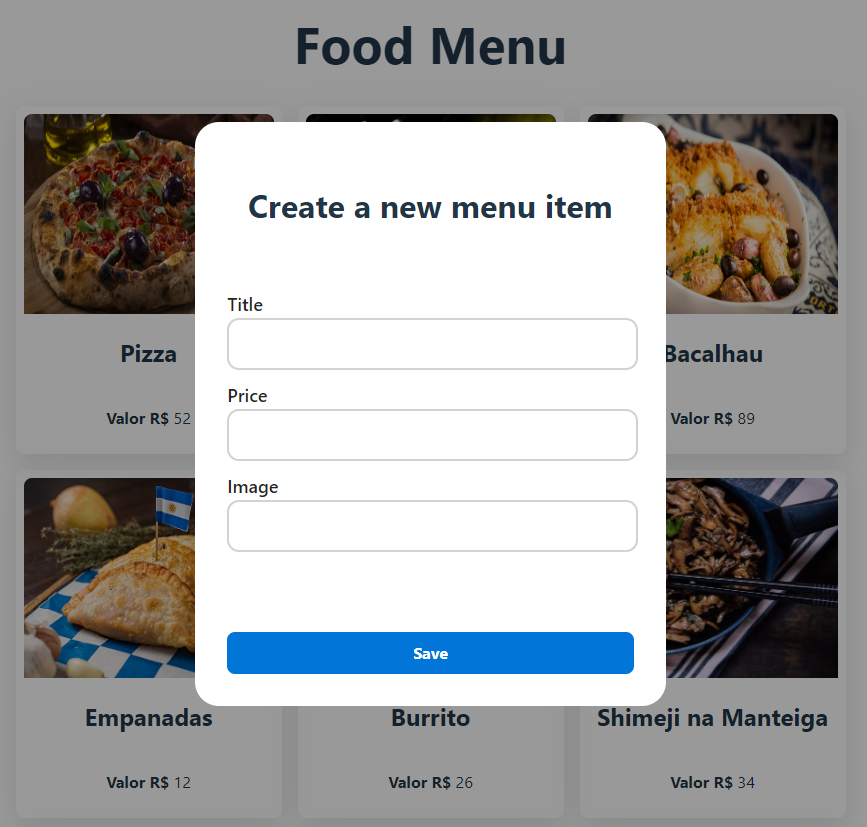

<h1 align="center">Food Digital Menu</h1>

  <a href="#-technologies">Technologies</a>&nbsp;&nbsp;&nbsp;|&nbsp;&nbsp;&nbsp;
  <a href="#-project">Project</a>&nbsp;&nbsp;&nbsp;|&nbsp;&nbsp;&nbsp;
  <a href="#-user-interface">Design</a>&nbsp;&nbsp;&nbsp;

## 🚀 Technologies

## 💻 Project
Web Application develop to provide a UI for digital food menu. This project was guided and developed with the help of instructional [Youtube Tutorial](https://www.youtube.com/watch?v=lUVureR5GqI).

## 🔖 Design

### 1. Menu Page
   
      

        
      

     
### 2. Create New Item
   
      

        
      
  

---

Thank you for get here! :wave: [GitHub](https://github.com/denisonkolling)
